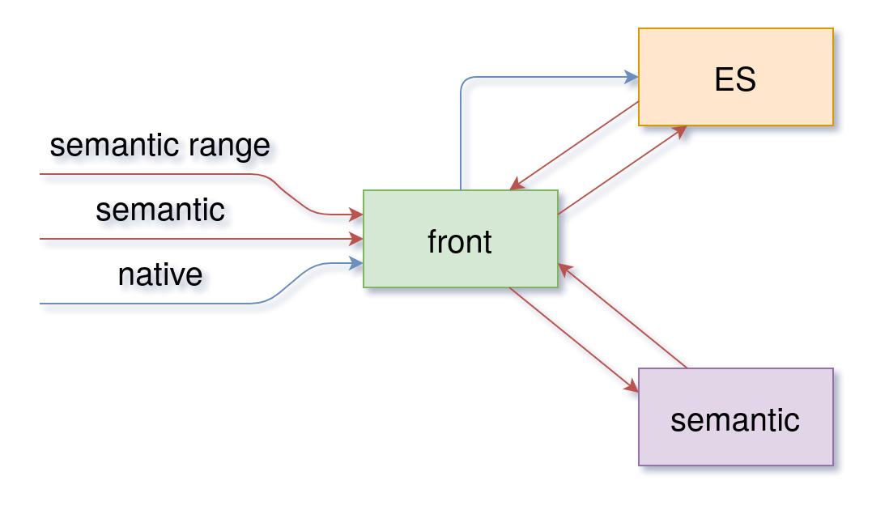

# Semantic search system

## About

This is a simple example of a semantic search system that implements both Elasticsearch and FAISS.

The reasoning behind this is that ES's support for text/sentence embeddings is fairly new, limited, and a field of ongoing work (Ref: [Text similary search with vector fields](https://www.elastic.co/blog/text-similarity-search-with-vectors-in-elasticsearch)). There are plugins that can implement approximate nearest neighbor (ANN) solutions in ES as described 
here: [Scalable Semantic Vector Search with Elasticsearch](https://medium.com/gsi-technology/scalable-semantic-vector-search-with-elasticsearch-e79f9145ba8e). However, I wanted to keep ES's native search possibilities but have an ANN solution separately.

## How it works

[`front`](front/README.md) is an API that communicates with ES and [`semantic server`](semantic/README.md) which is an API that represents FAISS.

In this example there are three kinds of queries:

- `native` - Text ES queries
- `semantic` - Semantic query that returns first top N hits
- `semantic range` - Semantic query that returns all articles in a defined range of similarity score

`semantic` server implements XLM-RoBERTa (optimized for sentence embeddings) which calculates query embeddings and searches FAISS index. 
In order to relate embeddings from FAISS with articles from ES, `semantic` server contains article uuids that are stored during the creation of FAISS index. In order for XLM-RoBERTa to work on large text queries, text is divided into chunks which are processed separately and combined into one embedding vector.

